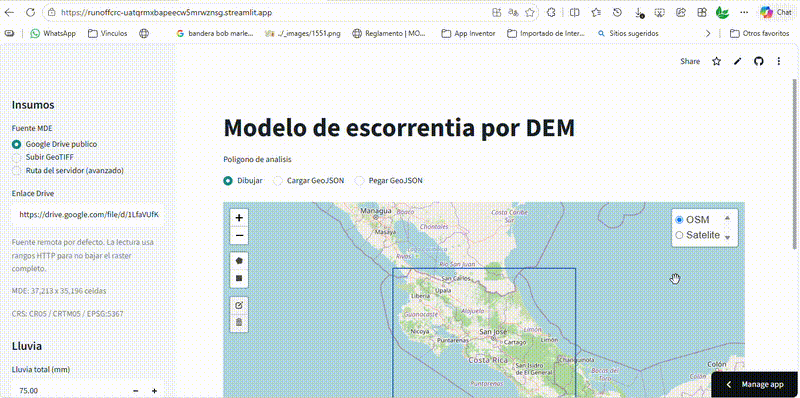

# Modelo de escorrentia por DEM para Costa Rica
<p align="center">
  
</p>

[](https://github.com/asoto59g/Runoff_CRC/actions/workflows/python-check.yml)
[](https://runoffcrc-uatqrmxbapeecw5mrwznsg.streamlit.app/)


Aplicacion Streamlit para simular escorrentia superficial, concentracion de flujo y zonas potencialmente inundables a partir de un modelo digital de elevacion (MDE/DEM). Esta orientada a analisis rapidos en Costa Rica con un MDE publico por defecto en `CR05 / CRTM05` (`EPSG:5367`), pero tambien permite subir un GeoTIFF georreferenciado de cualquier zona del mundo y trabajar sobre un poligono dibujado en el mapa o cargado en formato GeoJSON.

La app no descarga el MDE completo cuando se usa la fuente publica de Google Drive: resuelve el enlace publico, valida soporte de rangos HTTP y recorta solamente la ventana que intersecta el poligono de analisis. Si GDAL/Rasterio no logra abrir directamente el BigTIFF remoto de Drive, la app crea un GeoTIFF temporal con solo las teselas que cubren el poligono.

## App publicada

La aplicacion esta disponible en Streamlit Community Cloud:

https://runoffcrc-uatqrmxbapeecw5mrwznsg.streamlit.app/

## Que hace

- Muestra un mapa base OSM o satelital.
- Permite dibujar un poligono o cargar un GeoJSON.
- Usa por defecto un MDE publico en Google Drive o permite subir un GeoTIFF desde el equipo del usuario.
- Al cargar un GeoTIFF, lee su CRS y extension, dibuja el borde del MDE y hace zoom automatico sobre esa zona para digitalizar el poligono.
- Mantiene y resalta el poligono activo en el mapa de dibujo para evitar analizar una geometria equivocada.
- Recorta el MDE al area de interes para reducir memoria y tiempo de proceso.
- Lee BigTIFF remoto por rangos HTTP cuando Google Drive no funciona directamente como `/vsicurl`.
- Acondiciona hidrologicamente el MDE recortado para evitar que depresiones internas corten artificialmente la acumulacion.
- Calcula direccion de flujo D8 y area contribuyente acumulada.
- Simula lluvia efectiva con lluvia total, duracion, infiltracion, abstraccion inicial y coeficiente de escorrentia.
- Convierte geometrias WGS84/CRTM05 al CRS real del raster y estima dimensiones de pixel en metros para rasters proyectados o geograficos.
- Dibuja capas transparentes sobre el mapa base: cauce ocupado, desborde de rios, bajos/depresiones de llanura y concentracion de flujo.
- Exporta resultados como GeoTIFF y el poligono de analisis como GeoJSON WGS84.

## Capas generadas

- `Cauce ocupado`: red derivada de mayor acumulacion, con una franja base configurable. Por defecto representa un caudal existente con 5 m a cada lado del centro del cauce.
- `Desborde de rios`: franja lateral continua desde el cauce ocupado cuando la lluvia efectiva supera el umbral definido.
- `Bajos/depresiones`: zonas de llanura fuera del cauce y fuera del desborde donde existe acumulacion alta, pendiente baja o indice humedo alto.
- `Concentracion de flujo`: celdas con mayor area contribuyente acumulada, utiles para ubicar lineas de escorrentia.

## Instalacion

Clona el repositorio y entra al folder del proyecto:

```powershell
git clone https://github.com/asoto59g/Runoff_CRC.git
cd Runoff_CRC
```

Se recomienda usar un ambiente virtual:

```powershell
python -m venv .venv
.venv\Scripts\Activate.ps1
python -m pip install --upgrade pip
python -m pip install -r requirements.txt
```

## Ejecutar la app

```powershell
python -m streamlit run app.py
```

Luego abre la URL local indicada por Streamlit, normalmente:

```text
http://localhost:8501
```

## Flujo de trabajo

1. Selecciona la fuente del MDE: `Google Drive publico`, `Subir GeoTIFF` o `Ruta del servidor (avanzado)`. En Streamlit Cloud, usa `Subir GeoTIFF` para escoger archivos desde Windows; al cargarse, el mapa se centra automaticamente en la extension del TIFF.
2. Dibuja el poligono de analisis en el mapa centrado en el MDE o carga un GeoJSON. El poligono activo queda resaltado en naranja.
3. Ajusta lluvia total, duracion, infiltracion, abstraccion inicial y coeficiente de escorrentia.
4. Ajusta parametros de cauce, desborde y umbrales de analisis si es necesario.
5. Ejecuta la simulacion.
6. Revisa las capas sobre OSM o satelite y descarga los GeoTIFF resultantes.

## GeoTIFF local

En la app publicada, la opcion `Subir GeoTIFF` abre el selector normal del navegador y permite escoger archivos desde el equipo del usuario, por ejemplo desde Windows. El GeoTIFF puede estar en cualquier pais si trae CRS definido; la app transforma su extension a WGS84 para ubicarlo sobre OSM/satelite. La opcion `Ruta del servidor (avanzado)` navega el sistema de archivos donde corre Streamlit; en Streamlit Cloud ese servidor usa rutas Linux y no corresponde a las carpetas del usuario.

Para MDE grandes, normalmente conviene usar la fuente de Google Drive o preparar un recorte/COG, porque la subida por navegador depende del limite de archivo y memoria disponible en Streamlit Cloud. Para resultados hidrologicos mas consistentes se recomienda usar rasters proyectados en unidades lineales; si el raster esta en grados, la app estima el tamano de pixel en metros segun la ubicacion.

## Recorte remoto desde Google Drive

Tambien se incluye una utilidad CLI para descargar solo el recorte del MDE segun un GeoJSON:

```powershell
python clip_dem_by_polygon.py --geojson sample_polygon.geojson --output mde_recortado.tif
```

Con otro poligono y limite de celdas:

```powershell
python clip_dem_by_polygon.py --geojson mi_poligono.geojson --output mde_recortado.tif --max-cells 1000000
```

## Archivos principales

- `app.py`: interfaz Streamlit.
- `runoff_model.py`: recorte raster, acondicionamiento DEM, D8, acumulacion, cauces, inundacion relativa y exportacion.
- `remote_raster.py`: resolucion del enlace publico de Drive y lectura por rangos HTTP.
- `clip_dem_by_polygon.py`: utilidad CLI para recortar el MDE remoto/local con un GeoJSON.
- `sample_polygon.geojson`: poligono pequeno de prueba en WGS84.
- `requirements.txt`: dependencias Python para ejecutar la app.
- `.streamlit/config.toml`: configuracion visual basica de Streamlit.

## Preparacion para GitHub

El repositorio esta preparado para subir codigo y archivos livianos. No se deben versionar datos raster grandes, clips de prueba, logs, caches ni el video original; esos patrones estan incluidos en `.gitignore`.

Antes de publicar:

```powershell
python -m py_compile app.py runoff_model.py remote_raster.py clip_dem_by_polygon.py
git init
git remote add origin https://github.com/asoto59g/Runoff_CRC.git
git add app.py runoff_model.py remote_raster.py clip_dem_by_polygon.py sample_polygon.geojson README.md requirements.txt .gitignore .gitattributes .streamlit/config.toml .github/workflows/python-check.yml
git commit -m "Initial Streamlit runoff model"
git branch -M main
git push -u origin main
```

## Limitaciones

Este prototipo identifica zonas relativas de concentracion, cauce ocupado, desborde lateral y posible anegamiento segun topografia. No reemplaza un modelo hidraulico 1D/2D calibrado, no calcula tirantes reales, velocidades, niveles contra infraestructura, alcantarillas, redes pluviales, rugosidad espacial, uso de suelo ni curvas IDF oficiales.

El MDE publico por defecto esta etiquetado como `LOCAL_CS["CRTM05"]`; la app lo trata como `CR05 / CRTM05`, `EPSG:5367`. Los GeoTIFF cargados por el usuario usan su propio CRS cuando este es transformable a WGS84.
